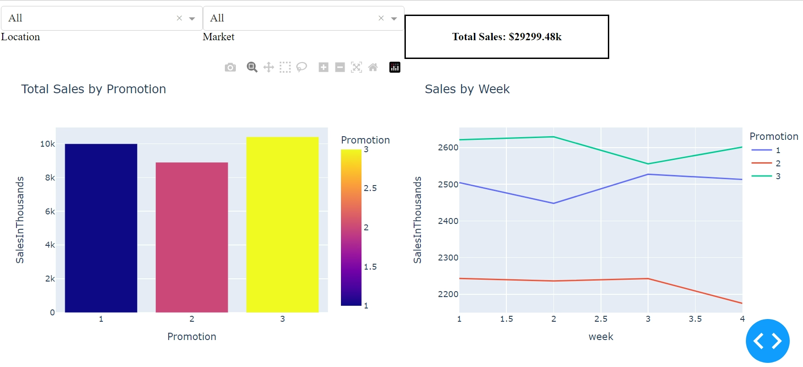

# Product Analytics

You can't improve something if you can't measure its performance. Products, whether physical, service-based, or software are ever-evolving things which require analytics to make improvements in the correct direction. In this repository, I look at different data sources to perform analysis and visualize results in A/B Testing, regression analysis, and product promotion performance.

### Files:

- `ab_test.ipynb` - A classic analysis of sales data over multiple "promotions". I perform exploratory data analysis, regression testing, and A/B Testing and draw conclusions.
- `app.py` - Plotly dash app with dynamic filters and a few visuals. *See the next section to run the app*
- `helpers.py` - a file holding some simple functions for analysis
- `simple_abtest.ipynb` - another A/B test performed on different data utilizing functions from helpers.

### Dash App:

To Run the Dashboard on your local machine, download this repo, create a virtual environment, install the required dependencies, and run the app.py file. You will be able to change the filters to see the differences in the data given the location or market.

```
git clone https://github.com/ty-martz/user-analytics.git
cd user-analytics/product-analytics

python -m venv env
source env/bin/activate
pip install -r requirements.txt

python app.py
```

